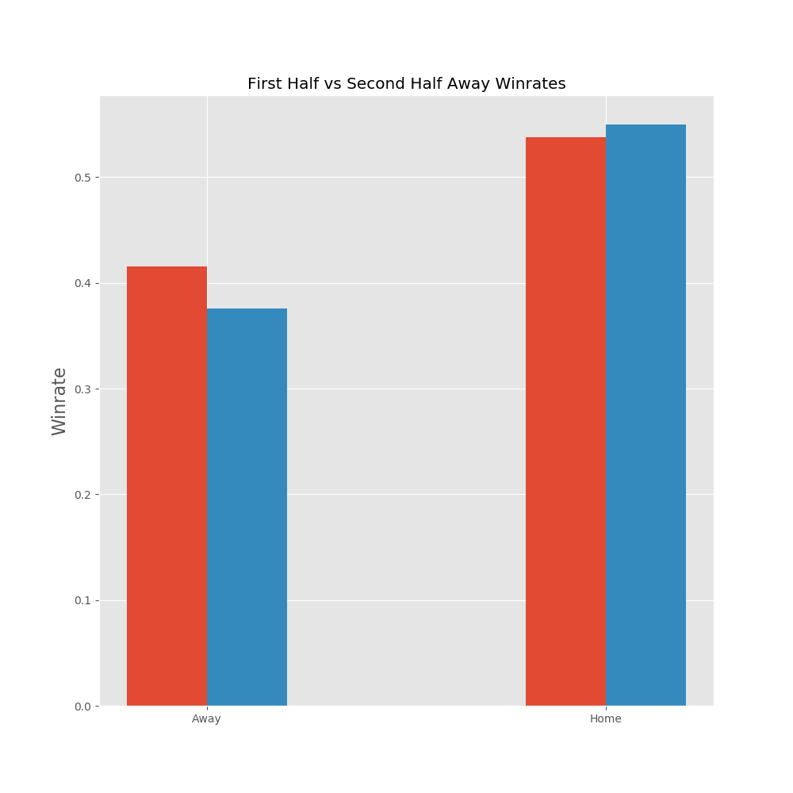
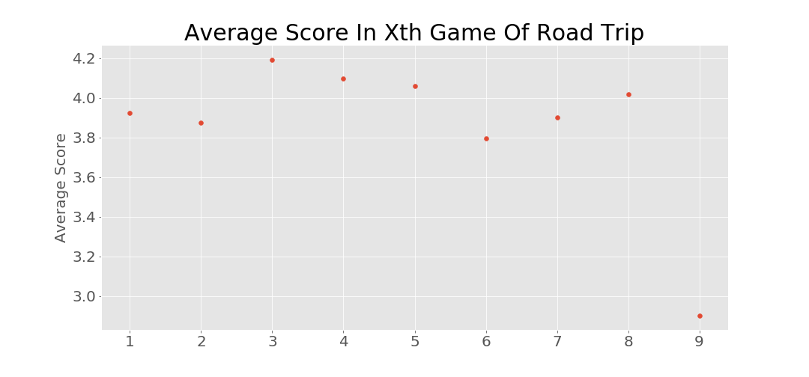

# coors-field-analysis

## Introduction

Coors Field is the highest elevation Major League Baseball stadium in the league. Coors Field is at 5200 ft elevation, with the next closest being Arizona's Chase Field at just 1100 ft and the vast majority being within 300 ft of sea level. The thinner and drier air has significant effects on how the ball moves, significantly benefitting the batters; Coors Field is consistently the run leader in the MLB.

Unfortunately, this seems to have a negative impact on Rockies players when they play outside of Coors Field. Iternalizing how pitches move at high altitude may not translate well to other MLB parks, and more aggressive batting styles that produce "borderline" hits at Coors may produce outs elsewhere. 

I'd like to investigate two topics; how exactly playing at Coors Field creates these disadvantages for batters on the road, and which batting styles are most and least affected by playing at the high altitude.

### Scope

I'm restricting data from 2002 onwards, since the Rockies ownership implemented several stadium and ball changes to attempt to decrease the runs scored, most notably the humidor. Yes, it used to be even worse!

## Data

Schedule data, which contain the aggregate stats of each game, was taken from [Retrosheets Gamelogs](https://www.retrosheet.org/gamelogs/index.html). Their data was quite clean, my data cleaning basically consisted of adding headers (with [their reference](https://www.retrosheet.org/gamelogs/glfields.txt)) and dropping (many!) extraenous columns.

The information used here was obtained free of
charge from and is copyrighted by Retrosheet.  Interested
parties may contact Retrosheet at "www.retrosheet.org".

With 2002-2018, we have about 2900 games and 1450 games of Away and Home games.

Statcast pitch-by-pitch data was obtained from Baseball Savant. Statcast has only been tracked to 2008, so any pitch by pitch analysis will be restricted from there.

## Effect Size

While every baseball team performs worse at visiting stadiums - the league wide "home field advantage" is roughly 54% - the Rockies perform especially badly relative to their home performance. Between 2000-2018, while they've won about 54% of their games at home, they've won just shy of 40% of their games on the road!

One metric is the  I took the ratio of each team's winrate at home and a team's winrate on the road. A team with the league average home advantage would have a .54/.46 ~ 1.17 ratio. The Colorado Rockies are a signficant outlier, with a 1.38 ratio.

<!---
Graph of ratio vs league av ratio over years?
-->

## Fatigue
 

One hypothesis is that Rockies players are especially fatigued from playing at altitude, from the environment itself and from frequently transiting between altitude. As a litimus test, let's look at their winrate in the first half* of the season vs the second half:

NOTE: Apparently 56% of Rockies September games are home games. As that'd be an obvious confounder given the huge difference in home/away winrate, I partitioned this into home/away.

We do see a significant drop in the away winrate between the first half and second half of the season, but oddly enough the home winrate actually rose. A fatigue thing would work regardless of where they're playing.

## Home/Away Tradeoff? (Rougher)

Hypothesis: There's a tradeoff between home/away prowess, training towards one detracts from the other. Was a big anti-correlation in home/away winrate in group by months, also the gap is smaller in April (after Spring Training done at a lower altitude field).

Other hand, I don't see an obvious mechanism for why this'd vary month by month. Salient features.

## Adjustment

Pitches move differently at Coors Field, particually curveball and "junk" ball pitches. Players have had difficulty adjusting to sea level pitches:

QUOTE FROM ATHLETIC:

"Yeah hitting away sucks at first lmao" - Charlie Blackmon

(this graph sucks fix it)

This tenatively contradicts the idea of an adjustment period. This could still be a long term thing, where playing at Coors throws off perception for longer than a road trip can "reset".