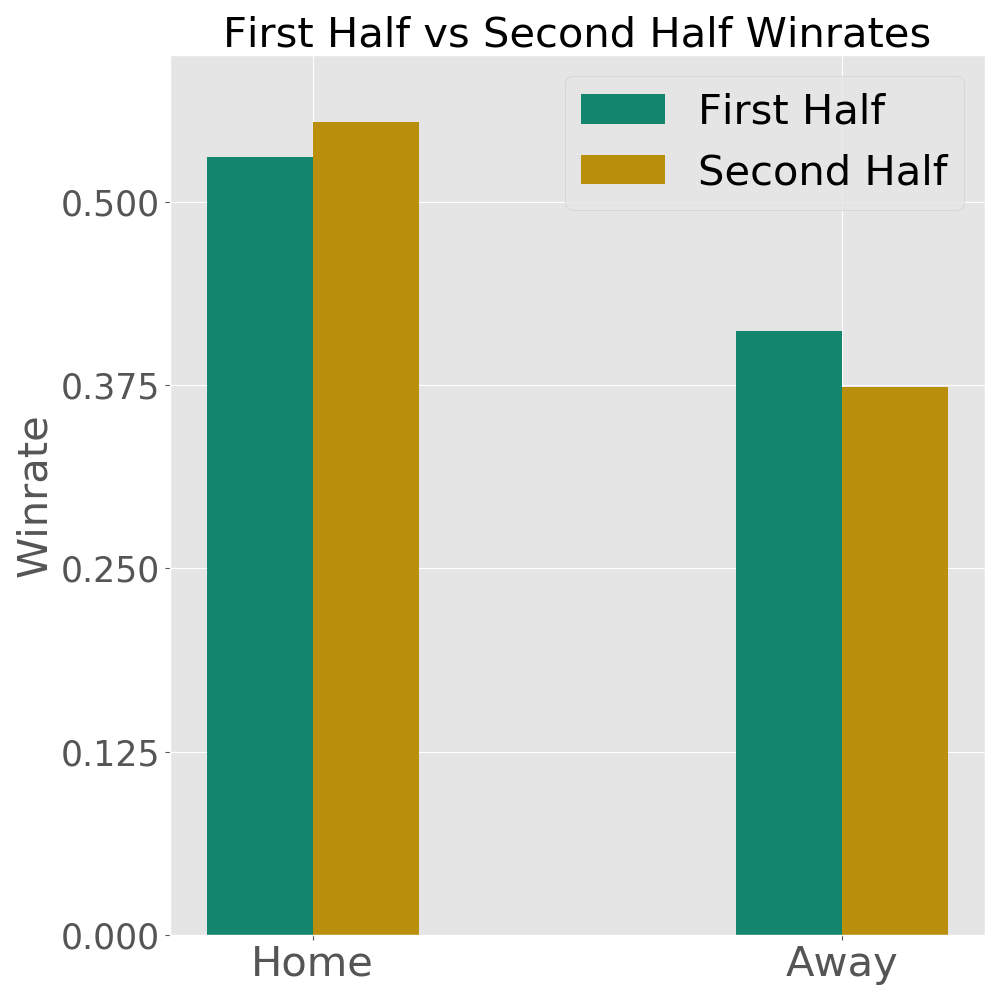
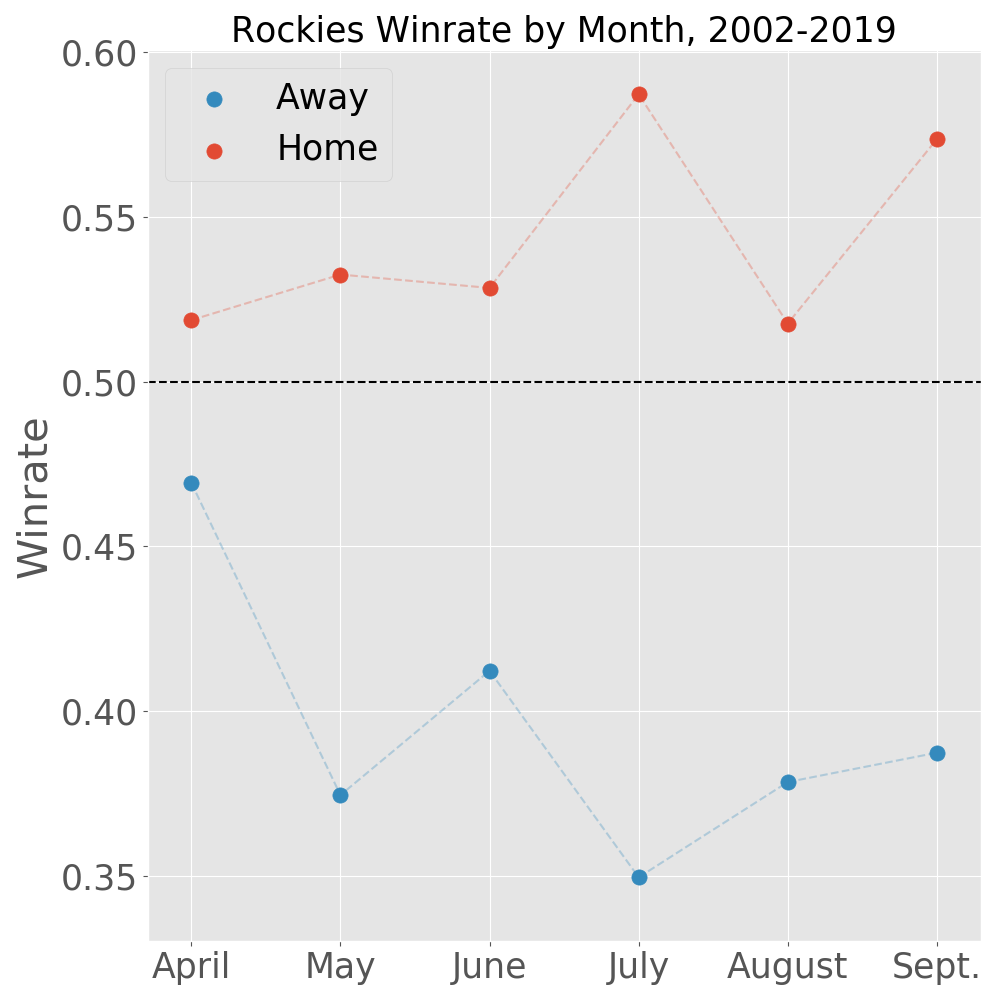

# Coors Field Analysis: Impact on Play In Other Parks

## Motivation

Coors Field is the highest elevation Major League Baseball stadium in the league. Coors Field is at 5200 ft elevation, with the next closest being Arizona's Chase Field at just 1100 ft and the vast majority being within 300 ft of sea level. The thinner and drier air significantly impacts how the ball moves, significantly benefitting the batters; Coors Field is consistently the run leader in the MLB.

Unfortunately, this seems to have a negative impact on Rockies players when they play outside of Coors Field. Internalizing how pitches move at high altitude may not translate well to other Major League parks, and more aggressive batting styles that produce "borderline" hits at Coors may produce outs elsewhere. I want to explore exactly how much playing at Coors Fields affects performance at other stadiums, and if possible extract what exactly is causing the effect.

## Data

I worked mainly with schedule data taken from Retrosheet's [Gamelogs Dataset](https://www.retrosheet.org/gamelogs/index.html), which records the game-by-game data of every MLB game since 1870. Each row records aggregate information about a major league baseball game, such as the runs (points) earned by each team, how many hits and the type of hits each team had, who the home and visiting teams were, and so forth. The dataset is basically comprehensive for the timeframe I'm working with (the Rockies didn't exist back in 1880!) with 63,000 games recorded since the Rockies' debut in 1993 and about 2,100 at Coors Field itself. 

The most relevant features for my purposes were the scoring data, the hitting data

I also restricted my analysis to the 2002 season onwards; the Rockies implemented several stadium and ball changes to decrease the runs scored (most notably a [humidor](https://en.wikipedia.org/wiki/Humidor) room for the baseballs) at the start of that season, which makes pre-2002 Coors Field data less relevant to the modern situation. That cut the dataset down to about 50,000 games total and 1,450 games at Coors Field.

Schedule data, which contain the aggregate stats of each game, was taken from [Retrosheets Gamelogs](https://www.retrosheet.org/gamelogs/index.html). Their data was quite clean, my data cleaning basically consisted of adding headers (with [their reference](https://www.retrosheet.org/gamelogs/glfields.txt)) and dropping (many!) extraenous columns.

<!---
Statcast pitch-by-pitch data was obtained from Baseball Savant. Statcast has only been tracked to 2008, so any pitch by pitch analysis will be restricted from there.
-->

## The Effect Size on the Road

Every baseball team performs worse at visiting stadiums; the visting team is using unfamiliar accomodations and has been travelling, umpires  the league wide "home field advantage" is roughly 54%.

The Colorado Rockies perform especially badly relative to their home performance. Between 2002-2018, they won about 54% of their games at Coors Field but less than 40% of their games away from it!

Consider took the ratio of each team's winrate at home and a team's winrate on the road. A team with the league average home advantage would have a .54/.46 ~ 1.17 ratio, or would win 17% more games on home than on the road. 

The Colorado Rockies are a huge outlier, winning almost 40% more games at home than away. The next few sections will attempt to suss out what exactly is causing this disadvantage.

# Fatigue
 
One hypothesis is that regular high altitude play tires out Rockies players more quickly than those (usually) playing at sea level, which might be further This'd be reflected as a slow decline in performance as the season goes on. Loo

NOTE: I split this analysis into home/away because 56% of Rockies September games are home games, which would be a huge confounder given the Home/Away winrates!

We do see a significant drop in the Away winrate between the first half and second half of the season, but oddly enough the Home winrate actually rose. A general fatigue would affect performance regardless of fields. Further partitioning by month reveals 

This doesn't show a slow decline from the first half to the second half, but rather an abnormally strong April road performance followed by more uniform performance for the rest of the season.

We can use a  test to check the signifiance of the April-later season winrates; our null hypothesis is that At . We find that the difference between the April Away and the rest of the season is significant,  A quick Chi Squared test suggests the April Away performance is significant at  = .05, (1, N = 1498) = 5.93, p = .015. However, that is it's drawing differently from the rest of the, but the overall Away season χ^2(1, N = 1498) = 5.93, p = .139. 

(There doesn't appear to be a trend in the Home data, and a quick χsquared test supports this this χ^2(5, N = 1498) = 4.32, p = .505

In any case, this data doesn't support a long term fatigue effect throughout the course of the season; we would expect and 

## Home/Away Tradeoff? (Rougher)

From last graph, there seems to be a trade-off between the monthly Home winrate and the Away winrate. 

Hypothesis: There's a tradeoff between home/away prowess, training towards one detracts from the other. Was a big anti-correlation in home/away winrate in group by months, also the gap is smaller in April (after Spring Training done at a lower altitude field).

Checking the correlation, it's quite low at -.76. And this seems to be something of an outlier in the league:

Two problems:

1. The Minnesota Twins are also an anticorrelated outlier, and I'm unaware of an equilvent Minnesota park factor that would explain this.
2. The correlations are wide ranged, I would exp
3. I don't know this'd vary so much month by month; if this was a thing I'd expect a gradual shift in either adjusting towards or against Coors Field as the season goes on.

Nonetheless, it's an interesting pattern that seems to at least waggle its eyes at something like a home/away tradeoff.

# Visting Team Fatigue
The Rockies play most of their games at altitude, but what about visting teams who aren't used to altitude? While they play less games at Coors Field, they also 

## Adjustment

Pitches move differently at Coors Field, particually curveball and "junk" ball pitches. Players have had difficulty adjusting to sea level pitches, as Rockies outfielder Charlie Blackmon explains:

>A pitch follows a peculiar path in the high elevation of Coors Field, but that is Blackmon’s normal. He knows how the arc of a pitch will perform in his home park. He honed that ability over time while watching tens of thousands of pitches there. But the day Blackmon leaves Denver for any of the 25 other cities in the major leagues, the baseball behaves differently...  
>“It’s amazing to see what guys can catch up to. Guys throw 100 now, but people can hit it,” Blackmon said. “It’s amazing what big-league players can do if they see it every day and become accustomed to it. It’s amazing what the level of play has become because the competition is getting so good, right? So for all those reasons, it’s very hard to have a ball act a certain way at altitude, and then have it act noticeably different the very next day when we go on the road."  
>[-The Atletic](https://theathletic.com/1649617/2020/03/04/inside-the-rockies-new-idea-to-finally-cure-the-coors-field-hangover) (Paywalled)

If this were the case, we'd expect the Rockies' batters to score more runs as they played more games away from 

This looks 

This tenatively contradicts the idea of an adjustment period. This could still be a long term thing, where playing at Coors throws off perception for longer than a road trip can "reset".

## Conclusions
There does appear to be 

I think it's interesting how aggregation can 