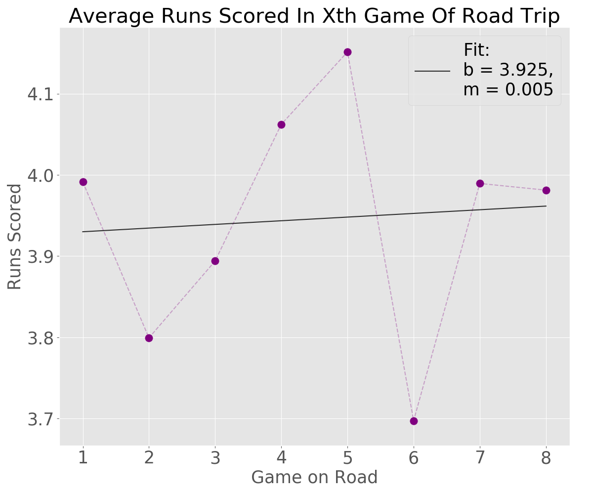

# Coors Field Analysis: How Playing At Altitude Affects Road Performance

## Motivation

Coors Field is the highest elevation Major League Baseball stadium in the league. Coors Field is at 5200 ft elevation, with the next closest being Arizona's Chase Field at just 1100 ft and the vast majority being within 300 ft of sea level. The thinner and drier air significantly impacts how the ball moves, significantly benefitting the batters; Coors Field is consistently the run leader in the MLB.

Unfortunately, this seems to have a negative impact on Rockies players when they play outside of Coors Field. Internalizing how pitches move at high altitude may not translate well to other Major League parks, more aggressive batting styles that produce "borderline" hits at Coors may produce outs elsewhere, and playing at altitude can be more taxing than playing at sea level. I want to explore exactly how much playing at Coors Fields affects performance at other stadiums, and if possible extract what factors are causing the effect.

## Data

I worked mainly with schedule data taken from Retrosheet's [Gamelogs Dataset](https://www.retrosheet.org/gamelogs/index.html), which records game-by-game data of every MLB game since 1870. Each row records information about a major league baseball game, such as the runs (points) earned by each team, how many hits and the type of hits each team had, and who the home and visiting teams were. Gamelogs had 63,000 games recorded since the Rockies' debut in 1993 and about 2,100 at Coors Field itself.

Gamelogs is basically comprehensive for the timeframe I'm working with (the Rockies didn't exist in 1890), although the raw data was seperated year by year and lacked headings. My data processing consisted of adding these headings (thankfully with the help of [Retrosheet's own reference](https://www.retrosheet.org/gamelogs/glfields.txt)), merged the yearly data together for multi-year analyses, and added several relevant features that were weirdly absent (like which team won the game)! The schema wasn't quite suited towards a specific team or stadium analysis - the relevant columns changed depending on whether they were the Home or Away team, and tracking that proved tedious in paralleized searches -  so I constructed tables for individual teams with the correct corresponding data.

I also restricted my analysis to the 2002 season onwards, as the Rockies implemented several major stadium and ball changes to decrease the runs scored  (most notably a [humidor](https://en.wikipedia.org/wiki/Humidor) room for the baseballs). That cut the working dataset down to about 50,000 games total and 1,450 games at Coors Field.

## The Effect Size on Road Performance

Every baseball team (and indeed most sports teams) perform worse at visiting stadiums, whether that's from travel fatigue or unfamiliarity with a stadiums' quirks or unconcious umpire bias. The Major League Baseball "home field advantage" is roughly .54, that is the Home team wins 54% of the time. But the Colorado Rockies perform especially badly relative to their home performance; between 2002-2018, they won about 54% of their games at Coors Field but just 39% of their games away from it!

I compared how Home reliant teams were by taking the ratio of their Home winrate and Away winrate, or how much more likely a team is to win at their Home Field. For example, the league as a whole would have a .54/.46 ~ 1.17 ratio and wins 17% more often at Home.

The Colorado Rockies are a huge outlier, winning almost 40% more games at home than away, beating out the next Home-iest team by 15 percentage points!

## Investigating Possible Causes

# Fatigue
 
One hypothesis is that regular high altitude play tires out Rockies players more quickly than those (usually) playing at sea level, which might be further This'd be reflected as a slow decline in performance as the season goes on. Looking at the winrates in the first half of the games in the season and the second half of games in the season.

(Note: I split this analysis into Home/Away because 56% of Rockies September games are home games, which would be a huge confounder given the Home/Away winrates above!)

We do see a significant drop in the Away winrate between the first half and second half of the season, but oddly enough the Home winrate actually rose. I investigated further by splitting the data into month by month:

Which suggests that the first/second half Road difference was mainly caused by an abnormally strong April performance, followed by a consistent (bad) performance for the rest of the season. We can use a  test to check the signifiance of this strong April road performance relative to the rest of the season, and that does suggest the performance is significant at  = .05, (1, N = 1498) = 5.93, p = .015.

(There doesn't seem to be any similiar trend in the Home data, and a quick  test supports this ((5, N = 1498) = 4.32, p = .505)

In any case, this data doesn't support the existence of a season long fatigue effect. We would expect a steady decrease in performance as the season goes on, not a sudden drop at the start and a tapering out. We'd also expect a similiar (if perhaps smaller) effect at Home, but instead there's (non-signficant) improvement in the second half.

<!-- ## A Coors/non-Coors Field Tradeoff?

Those Home winrates and the Away winrates looks pretty anticorrelated in that month-by month graph; when the Home winrate rises the Away winrate seems to fall in turn, and vice versa.

This suggests a literal tradeoff between . This would also explain the unusually high April winrate; the Rockies have a training camp in Febuary+March at a seperate near-sea level facility, 

The measured correlation between those winrates is -0.76, and this seems to be somewhat of an outlier in the league:

I'm hesitant to conclude too much here. The Minnesota Twins are the other anticorrelated outlier, and I'm not aware of any Minnesota park factor that'd produce a similiar result. And I don't know why this adjustment would vary so much month to month, I'd again expect a gradual shift in one of the directions. But nonetheless, it's an interesting (anti)correlation that at least hints at a tradeoff.

EDIT: Nah I know this is spurious. I want this because it shows that I'm actually thinking about the problem beyond "Here's my MVP!", but this is needlessly confusing and flow breaking just to show off.
 -->

## Batter Adjustment Period

Pitches move differently through the thinner air at Coors Field, which creates differences in the millisecond adjustments batters need to hit the ball. If a Rockies player trains mostly at Coors Field, their adjustments may suddenly not work at sea-level fields without further practice. As Rockies outfielder Charlie Blackmon puts it:

>“Guys throw 100 \[miles-per-hour\] now, but people can hit it,” Blackmon said. “It’s amazing what big-league players can do if they see it every day and become accustomed to it... So for all those reasons, it’s very hard to have a ball act a certain way at altitude, and then have it act noticeably different the very next day when we go on the road."  
>[-The Athletic](https://theathletic.com/1649617/2020/03/04/inside-the-rockies-new-idea-to-finally-cure-the-coors-field-hangover) (Paywalled)

If Rockies batters like Blackmon are having initial difficulties when they start a road trip, we'd expect them to score more runs in the later games of road trips, when they've had time to adjust to sea-level pitches. I extracted the average runs scored in the first game of a Rockies road trip, the second game in a road trip and so forth:

What I found doesn't particually support the idea of a short term adjustment period, there's no clear upward trend in runs scored as the road trip length continues.

(This test wouldn't catch _long term_ adjustment problems, if playing at Coors Field threw off a Rockies batter's perception where they can't fully adjust with a short-term sea-level practice.)